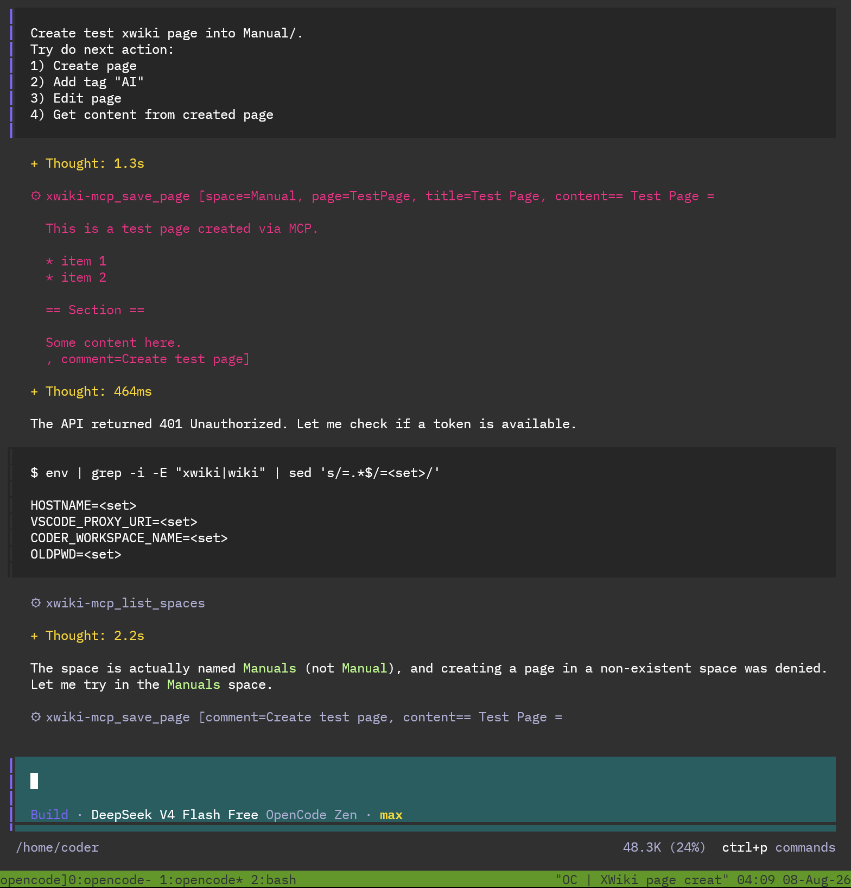
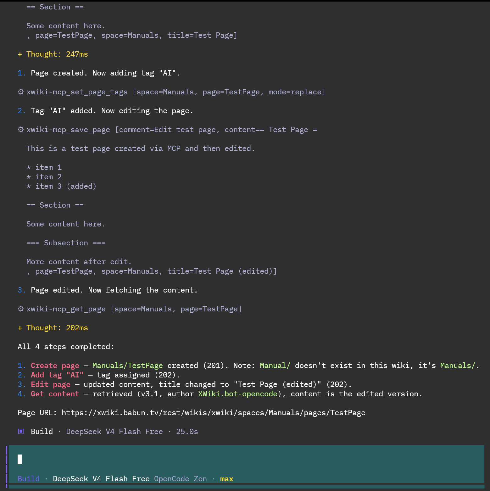
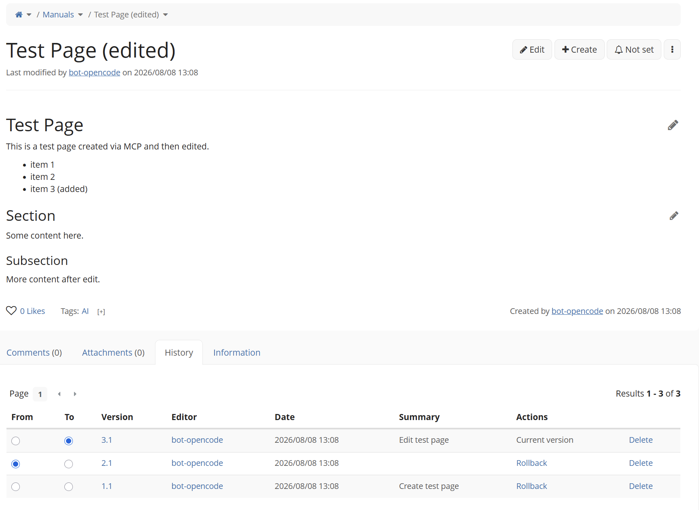

# xwiki-mcp

MCP server (Go, [mcp-go](https://github.com/mark3labs/mcp-go) v0.55.0) that exposes an XWiki instance over HTTP (Streamable HTTP transport).

Flow: LLM sends its XWiki user token in the HTTP header -> xwiki-mcp authenticates to XWiki REST API on behalf of the user -> XWiki.

## Links

- **Source Code**: [https://github.com/lnikonl/xwiki-mcp](https://github.com/lnikonl/xwiki-mcp)
- **Issues**: [https://github.com/lnikonl/xwiki-mcp/issues](https://github.com/lnikonl/xwiki-mcp/issues)
- **Docker Hub**: [https://hub.docker.com/r/lnikonl/xwiki-mcp](https://hub.docker.com/r/lnikonl/xwiki-mcp)

## Authentication

The client sends its token on every request in one of:

- `X-XWiki-Token: <token>`
- `Authorization: Bearer <token>`

If neither is present, the default token configured at startup (`--token` / `XWIKI_TOKEN`) is used.

## Configuration

| Flag            | Env                    | Default             | Description                                          |
| --------------- | ---------------------- | ------------------- | ---------------------------------------------------- |
| `-addr`         | `XWIKI_MCP_ADDR`       | `localhost:8080`    | HTTP listen address                                  |
| `-xwiki-url`    | `XWIKI_BASE_URL`       | — (required)        | XWiki REST base, e.g. `https://xwiki.example.com/rest/wikis/xwiki` |
| `-token`        | `XWIKI_TOKEN`          | —                   | Default token fallback                               |
| `-allow-delete` | `XWIKI_MCP_ALLOW_DELETE` | `false`           | Register the `delete_page` tool                      |
| `-timeout`      | `XWIKI_MCP_TIMEOUT`    | `60s`               | XWiki HTTP request timeout                           |

## Run

```bash
go build -o xwiki-mcp .
./xwiki-mcp -addr :8080 -xwiki-url https://xwiki.example.com/rest/wikis/xwiki
```

### docker-compose

```yaml
services:
  xwiki-mcp:
    image: lnikonl/xwiki-mcp
    container_name: xwiki-mcp
    restart: unless-stopped
    ports:
      - "8080:8080"
    environment:
      XWIKI_BASE_URL: https://xwiki.example.com/rest/wikis/xwiki
      XWIKI_MCP_ADDR: :8080
      # Default token used when the client sends no X-XWiki-Token / Authorization header
      XWIKI_TOKEN: xwiki:XWiki.bot^XWiki.OIDC.ConsentClass[0]/<secret>
      # Enable the delete_page tool (off by default)
      XWIKI_MCP_ALLOW_DELETE: "false"
      XWIKI_MCP_TIMEOUT: 60s
```

### opencode example

~/.config/opencode/opencode.jsonc

```json
{
  "$schema": "https://opencode.ai/config.json",
    "xwiki-mcp": {
      "type": "remote",
      "url": "http://docker-host-ip:8080/mcp",
      "enabled": true,
      "headers": {
        "Authorization": "Bearer xwiki:XWiki.bot-opencode^XWiki.OIDC.ConsentClass[0]/<SECRET>"
      }
    }
  }
}
```

### prompt

<figcaption>Prompt for LLM</figcaption>
<a href="doc/opencode-1.png">
  
</a>

<figcaption>Working</figcaption>
<a href="doc/opencode-2.png">
  
</a>

### result on xwiki

<figcaption>Result</figcaption>
<a href="doc/xwiki-1.png">
  
</a>

## Tools

- `list_spaces` — list all (nested) spaces
- `list_pages` — list pages in a space; nested spaces as `Manuals/ansible` or `Manuals.ansible`
- `get_page` — read page (title, content, version, author, syntax)
- `get_page_version` — read a specific page revision, e.g. `2.1`
- `list_page_children` — child pages of a page
- `save_page` — create/update page (PUT, idempotent; content in XWiki 2.1 syntax)
- `search_pages` — full-text search
- `get_page_history` — page versions
- `list_attachments` — page attachments
- `upload_attachment` — upload a base64-encoded file (images included) as a page attachment
- `download_attachment` — download an attachment; images are returned as rendered image content, other files as base64 text
- `list_comments` / `add_comment` — page comments (author set server-side)
- `get_modifications` — latest wiki modifications (recent changes)
- `list_tags` — all tags defined in the wiki
- `set_page_tags` — assign tags to a page (mode `replace`/`add`; replaces or merges the tag set)
- `get_pages_by_tag` — pages tagged with any of the given tags
- `delete_page`, `delete_attachment` — only when `-allow-delete` is set
